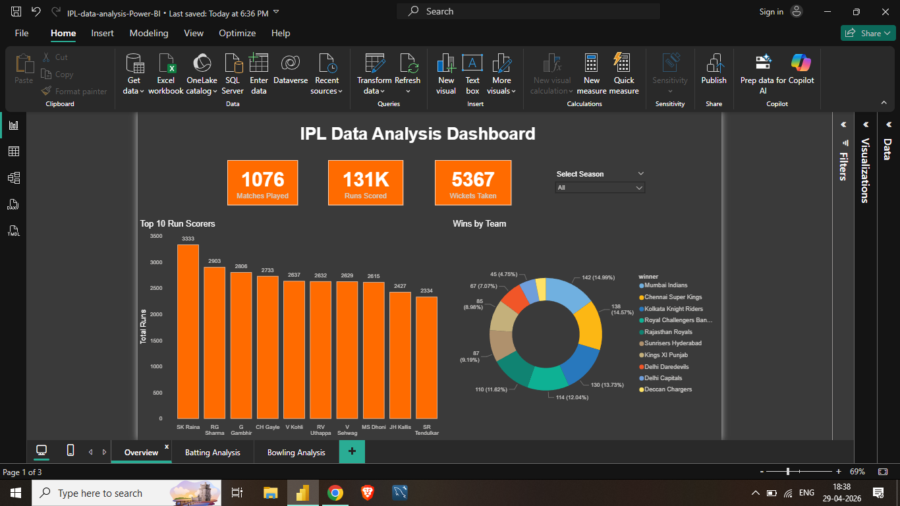

# 🏏 IPL Data Analysis (2008-2020)

> Analyzing 12 years of IPL cricket data using 
> MySQL and Power BI to uncover team performance, 
> player insights and match winning patterns.

---

## 📌 Project Overview
This project performs end-to-end analysis on IPL 
match data from 2008 to 2020.

It covers:
- Team performance analysis
- Player batting and bowling insights
- Toss and venue impact on match results
- Chase master identification
- Season-wise Orange and Purple Cap winners

---

## 📂 Dataset
| Detail | Info |
|---|---|
| Source | Kaggle - IPL Complete Dataset |
| Link | https://www.kaggle.com/datasets/patrickb1912/ipl-complete-dataset-20082020 |
| matches table | 1,076 rows |
| deliveries table | 1,06,670 rows |
| Seasons covered | 2008 to 2020 |

> Dataset not uploaded due to file size. 
> Download directly from Kaggle link above.

---

## 🛠️ Tools Used
- MySQL
- MySQL Workbench
- Power BI (Interactive 3-page Dashboard)

---

## 🗂️ Database Schema

**matches table** — one row per match
- id, season, city, date, team1, team2
- toss_winner, toss_decision
- winner, win_by_runs, win_by_wickets
- player_of_match, venue

**deliveries table** — one row per ball bowled
- match_id, inning, batting_team, bowling_team
- batter, bowler, batsman_runs, total_runs
- dismissal_kind, is_wicket

---

## 📊 Key Findings At A Glance

| Question | Finding |
|---|---|
| Most successful team | Mumbai Indians (142 wins) |
| Toss advantage | Field first wins 54% vs bat first 45% |
| Top run scorer | SK Raina (3,333 runs) |
| Best chase master | G Gambhir (1,251 runs in chases) |
| Top wicket taker | SL Malinga (133 wickets) |
| Best strike rate | GJ Maxwell (169.71) |
| Most matches hosted | Eden Gardens (77 matches) |

---

## 🔍 Business Questions Answered

### 1. Which team won the most matches?
- Mumbai Indians dominate with 142 wins
- Most successful IPL franchise in history

### 2. Does winning toss help win the match?
- Teams choosing FIELD won 54% of matches
- Teams choosing BAT won only 45% of matches
- Chasing is a clear T20 advantage

### 3. Who are top 10 batsmen by total runs?
- SK Raina leads with 3,333 runs
- RG Sharma second with 2,903 runs
- G Gambhir third with 2,806 runs

### 4. Who scored most runs in winning matches?
- Used JOIN across matches and deliveries tables
- SK Raina scored 2,183 runs in winning matches
- 65% of his runs came in matches his team won

### 5. Who are the top wicket takers?
- SL Malinga leads with 133 wickets
- A Mishra second with 109 wickets

### 6. Which venue hosted the most matches?
- Eden Gardens hosted 77 matches
- Wankhede Stadium second with 72 matches

### 7. Orange Cap — Top scorer per season?
- Used CTE and Window Functions
- CH Gayle topped twice in 2011 and 2012
- SR Tendulkar topped in 2009/10 season

### 8. Purple Cap — Top wicket taker per season?
- Used CTE and Window Functions
- SL Malinga most consistent across seasons

### 9. Who has the best strike rate?
- Minimum 200 balls filter applied
- GJ Maxwell leads with 169.71 strike rate
- V Sehwag maintained 150+ across 1,744 balls

### 10. Who scored most in successful run chases?
- Filtered inning = 2 and winning batting team
- G Gambhir leads with 1,251 runs
- Context of runs matters more than volume

---

## ⚠️ Data Quality Issue Found and Fixed
The dismissal_kind column had text value NA 
instead of proper NULL for non-wicket deliveries.
Identified, investigated and fixed by filtering 
NA values explicitly.
This is a common real world dirty data problem.

---

## 💡 SQL Concepts Used
- GROUP BY and COUNT
- Conditional Aggregation (CASE WHEN inside SUM)
- JOIN across two tables
- Data cleaning with IS NOT NULL and NOT IN
- HAVING clause for post aggregation filtering
- Window Functions (RANK, PARTITION BY)
- CTEs (Common Table Expressions)
- ROUND for decimal formatting

---

## 📊 Power BI Dashboard

An interactive 3-page Power BI dashboard built 
on the same IPL dataset.

### Pages:
- **Overview** – KPI cards (Matches, Runs, Wickets), Top 10 Run Scorers, Wins by Team
- **Batting Analysis** – Top 10 Run Scorers, Sixes & Fours Comparison
- **Bowling Analysis** – Top 10 Wicket Takers, Economy Rate Comparison

### Features:
- Dark theme with consistent orange color scheme
- Interactive slicers for Season and Player filtering
- DAX measures for Total Runs, Wickets, Sixes, Fours, Economy Rate

### Dashboard Preview:



---

## 📁 Repository Structure
```
ipl-data-analysis-sql/
│
├── README.md
├── LICENSE
├── ipl_analysis.sql
│
├── screenshots/
│   ├── query1_team_wins.png
│   ├── query2_toss_impact.png
│   ├── query3_top_batsmen.png
│   ├── query4_batsmen_winning_matches.png
│   ├── query5_top_wickets.png
│   ├── query6_top_venues.png
│   ├── query7_orange_cap.png
│   ├── query8_purple_cap.png
│   ├── query9_strike_rate.png
│   └── query10_chase_masters.png
│
└── power-bi-dashboard/
    ├── IPL-data-analysis-Power-BI.pbix
    ├── Overview.png
    ├── Batting Analysis.png
    └── Bowling Analysis.png
```

---

## 📄 License
This project is licensed under the MIT License.
See the [LICENSE](LICENSE) file for details.
